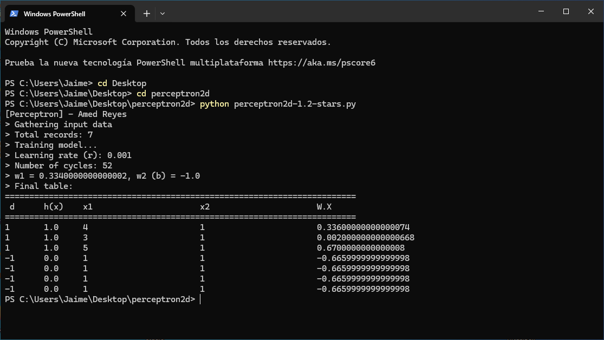

# my-ML
Machine learning samples

## computer-vision

Example of automatic video annotation made with the CVAT software using pre-trained model.

## Perceptron

The example above shows a simple classification problem of 5-star user ratings.
The hypothetical data shows that customers with higher than 1 star have higher probability of comming back. The labels are *-1* and *1*, *d* is the label, `w1` and `w2` are the weights, and `h(x)` is the output function.

Bias is `b = -1`